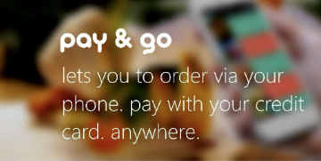
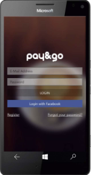
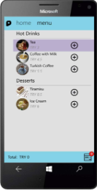
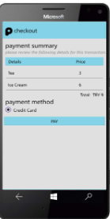
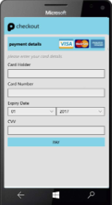

# Pay & Go
 

## What is Pay & Go
Pay & Go is my graduation project, a product prototype that I built back in 2014. It helps people when they go out. People can place an order with their mobile phones, and pay the check with credit card through the application. 

The app runs on Windows 10 Mobile. The restaurant back office is built with ASP.NET MVC 4.5.

## Pay & Go enables people 'Go Dutch!'
Pay  & Go also offers <i>splitting the check</i>. For each person on the table, different sessions starts.
With the aid of different sessions, it is possible to pay the check separately. Pay & Go is the best way to <i>go dutch</i>.

# Screenshots
|  |  |
|--|--|
|  |  |

